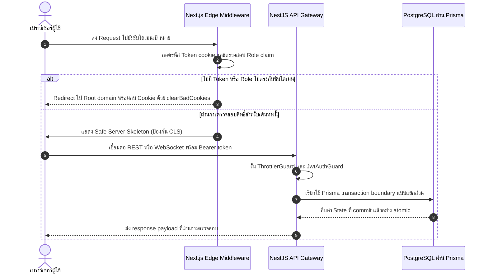

# SwiftPath: โครงสร้างพื้นฐานโลจิสติกส์แบบหลายพอร์ทัลและเครื่องยนต์การเงินที่ปลอดภัยจาก Race Condition

> Engineering Case Study — แพลตฟอร์มโลจิสติกส์ระดับพาณิชย์บนสถาปัตยกรรมแบบแยกซับโดเมนและ Zero-Trust Security

---

## 1. บทสรุปผู้บริหารและขอบเขตของปัญหา

SwiftPath คือแพลตฟอร์มบริหารจัดการโลจิสติกส์และพัสดุระดับพาณิชย์ที่ทำงานบนสถาปัตยกรรมแบบกระจายศูนย์และแยกซับโดเมนอย่างเด็ดขาด ความท้าทายทางวิศวกรรมของระบบนี้ขยายออกไปไกลกว่าการทำ CRUD ธรรมดามาก เพราะแพลตฟอร์มต้องทำงานได้อย่างถูกต้องภายใต้เงื่อนไขที่ซับซ้อนสูงดังนี้

**ความสอดคล้องของข้อมูลภายใต้ภาวะพร้อมกันสูง:** ระบบต้องรักษาความถูกต้องของยอดเงินในกระเป๋าและสถานะออเดอร์ให้สมบูรณ์ แม้จะมีการ write พร้อมกันหลายรายการในระดับมิลลิวินาที เช่น Stripe top-up Webhook ที่ประมวลผลในเวลาเดียวกับที่ร้านค้าตัดเงินค่าจัดส่ง

**การแยกพื้นที่โจมตีของผู้เช่าหลายราย:** ระบบบังคับใช้ขอบเขตการเข้าถึงข้อมูลอย่างเคร่งครัดระหว่างผู้ใช้ 4 บทบาท ได้แก่ ลูกค้า, ร้านค้า, คนขับ, และผู้ดูแลระบบ แต่ละกลุ่มถูกจำกัดไว้ในซับโดเมนของตัวเอง การเข้าถึงข้ามบทบาทด้วยการแก้ไข URL (IDOR Attack) ต้องเป็นไปไม่ได้โดยโครงสร้าง ไม่ใช่แค่พึ่งพาการตรวจสอบระดับแอปพลิเคชัน

**การประสานงานเหตุการณ์แบบเรียลไทม์โดยไม่สร้างภาระให้ฐานข้อมูล:** ข้อมูลตำแหน่ง GPS ของคนขับและการแจ้งเตือนสถานะพัสดุต้องส่งถึงกันแบบทันทีทันใดผ่าน WebSocket ที่ตรวจสอบ JWT ทุกครั้ง โดยไม่ก่อให้เกิดการ polling โหลดกับฐานข้อมูลหลัก

---

## 2. สถาปัตยกรรมระบบและโครงสร้างองค์ประกอบ

ระบบประกอบด้วยสามชั้นหลัก คือ Edge Security Gateway (Next.js Middleware), ชั้น Application API (NestJS), และชั้น Persistence (PostgreSQL ผ่าน Prisma ORM) การสื่อสารระหว่างบริการทั้งหมดผ่านขอบเขตที่ควบคุมโดย Docker bridge network และสัญญา API ที่ตรวจสอบด้วย JWT

### 2.1 ทะเบียนพอร์ทัลซับโดเมน

| พอร์ทัล | URL สำหรับพัฒนา | บทบาทที่อนุญาต | หน้าที่หลัก |
| :--- | :--- | :--- | :--- |
| Root / Admin | `http://localhost:3000/admin` | Admin | Dashboard วิเคราะห์ส่วนกลาง, จัดการผู้ใช้, Seeding ข้อมูล |
| Customer | `http://app.localhost:3000` | Customer | ติดตามพัสดุสาธารณะ, จัดการกระเป๋าเงิน, ประวัติออเดอร์ |
| Merchant | `http://store.localhost:3000` | Merchant | สร้างออเดอร์, คำนวณ Surge Price, วิเคราะห์รายได้ |
| Driver | `http://fleet.localhost:3000` | Driver | รับงานผ่าน Radar Map, ส่ง GPS, สะสมรายได้ |

### 2.2 ขั้นตอนการตรวจสอบสิทธิ์ของ Request

แผนภาพลำดับด้านล่างแสดงเส้นทางของ Request ที่ผ่านจุดตรวจสอบขอบเขตระบบทั้งหมด



### 2.3 Technology Stack

**ชั้น Frontend**
- Framework: Next.js (App Router) พร้อมระบบ routing ตามซับโดเมน
- Language: TypeScript เพื่อความปลอดภัยของ type ในระดับ compile-time
- Styling: Tailwind CSS v4 — design system สำหรับ production
- State และ Data: Axios (REST client), Socket.io-client (real-time sync)
- Visualization: Recharts (analytics dashboard), Leaflet.js (แผนที่กองยาน)

**ชั้น Backend**
- Framework: NestJS (Node.js) — สถาปัตยกรรมแบบ module ที่ inject dependency ได้
- Database: PostgreSQL ผ่าน Prisma ORM พร้อม type ที่เข้มงวดและรองรับ atomic transaction
- Security: Passport.js (JWT strategy), SHA-256 OTP hashing, NestJS Throttler (Rate Limiting)
- Real-Time: Socket.io Gateway พร้อมตรวจสอบ JWT signature ทุก event
- Infrastructure: Docker และ Docker Compose สำหรับ provision database แบบ container

---

## 3. การตัดสินใจทางสถาปัตยกรรมหลักและเหตุผลทางเทคนิค

### 3.1 การควบคุมภาวะพร้อมกัน — Optimistic Locking ผ่านฟิลด์ version

**บริบทของปัญหา:** ในระบบกระเป๋าเงินแบบ multi-tenant ยอดเงินของผู้ใช้อาจถูกเขียนพร้อมกันจากสองช่องทางอิสระ เช่น Stripe Webhook ที่กำลัง credit top-up อาจชนกับการ debit ค่าจัดส่งของร้านค้า ทั้งสองมาถึงภายในมิลลิวินาทีเดียวกัน

**การตัดสินใจทางสถาปัตยกรรม:** ระบบใช้ Optimistic Concurrency Control (OCC) ผ่านฟิลด์ `version` ชนิด integer ที่กำหนดในระดับ schema ฐานข้อมูลบน model `Customer`, `Merchant`, และ `Driver` ทุกการแก้ไขยอดเงินต้องเพิ่มค่าฟิลด์นี้อย่าง atomic ภายใน `prisma.$transaction`

```prisma
model Customer {
  balance  Decimal @default(0)
  version  Int     @default(0)  // ป้องกัน Race Condition — ตัวนับรุ่นของการแก้ไข
}
```

**การวิเคราะห์ข้อดีข้อเสีย:**

| มิติที่ประเมิน | ผลลัพธ์ |
| :--- | :--- |
| ปริมาณการอ่าน | ดีขึ้นอย่างมาก — ไม่มีการล็อคระหว่างการอ่าน |
| การชนกันของการเขียน | ฝ่ายที่แพ้จะถูกปฏิเสธทันที ไม่มีการสะสม deadlock |
| ความเสี่ยง Deadlock | ถูกกำจัดโดยการออกแบบ — ไม่มีการถือ pessimistic row lock |
| ความรับผิดชอบ Retry | ย้ายไปอยู่ที่ application layer — ต้องมี retry queue สำหรับกรณีที่ชนกันสูง |

### 3.2 ความ Idempotency ทางการเงิน — Unique Constraint ระดับฐานข้อมูลเป็นตาข่ายความปลอดภัย

**บริบทของปัญหา:** ข้อกำหนดการส่ง Webhook ของ Stripe ระบุว่าจะส่งอย่างน้อยหนึ่งครั้ง (at-least-once delivery) หมายความว่า event เดียวกันอาจถูกส่งมาหลายครั้ง ถ้าไม่มีการป้องกัน idempotency ทุกครั้งที่รับ event ซ้ำจะทำให้ยอดเงินถูก credit เพิ่มโดยไม่ถูกต้อง

**การตัดสินใจทางสถาปัตยกรรม:** ตาราง `Transaction` บังคับใช้ constraint `@unique` บนคอลัมน์ `referenceId` ซึ่งบันทึก Stripe PaymentIntent ID ไว้ การตรวจสอบ idempotency ทำงานอยู่ภายใน `prisma.$transaction` block เดียวกับการ write ยอดเงิน เพื่อกำจัดช่องว่างเวลาของ TOCTOU race condition

```prisma
model Transaction {
  referenceId String? @unique  // Stripe PaymentIntent ID — กุญแจ idempotency
}
```

### 3.3 ความปลอดภัยของ Edge Gateway — การแยก Role ตามซับโดเมน

**บริบทของปัญหา:** การโจมตีแบบ IDOR (Insecure Direct Object Reference) ทำงานได้ดีที่สุดเมื่อการตรวจสอบสิทธิ์อยู่แค่ในชั้น application เท่านั้น ถ้า Merchant แก้ URL บนเบราว์เซอร์เพื่อเข้าสู่ `app.localhost:3000` ระบบต้องปฏิเสธโดยโครงสร้าง

**การตัดสินใจทางสถาปัตยกรรม:** การบังคับใช้ Role ทั้งหมดอยู่ใน Next.js Edge Middleware (`middleware.ts`) ซึ่งทำงานก่อนที่ React component จะ render แม้แต่ครั้งเดียว Middleware ตรวจสอบ cookie `role` ควบคู่กับซับโดเมนที่ใช้งาน และ redirect คำขอที่ข้ามบทบาทออกไปพร้อมลบ session cookie

```text
checkAdminAccess    — ตรวจสอบก่อนเสมอ ตัดทุก check อื่นถ้าเจอ Admin path
checkAuthPageAccess — ป้องกันผู้ที่ login แล้วกลับเข้าหน้า Login ซ้ำ
checkCustomerAccess — บังคับ Customer เท่านั้นบน app.localhost
checkMerchantAccess — บังคับ Merchant เท่านั้นบน store.localhost
checkDriverAccess   — บังคับ Driver เท่านั้นบน fleet.localhost
```

---

## 4. บันทึกการแก้ไขบั๊กวิกฤต

### BUG-001: Admin วนลูป Redirect ไม่รู้จบ

**อาการ:** บัญชี Admin ที่พยายามเข้า `/admin` ถูกดักจับในวงวน redirect ที่ไม่มีที่สิ้นสุด ทำให้ session cookie ถูกลบและถูก logout โดยไม่ตั้งใจ

**สาเหตุ:** ฟังก์ชัน `checkAuthPageAccess` ดั้งเดิมปฏิบัติกับทุก Role อย่างเหมือนกัน เมื่อ Admin เข้า auth path บน root domain ฟังก์ชันนี้ประเมิน token ของ Admin กับ logic ของซับโดเมน `app` พบว่า Role ไม่ตรง จึงเรียก `clearBadCookies` แล้ว redirect — สร้างวงวน

**การแก้ไข:** ฟังก์ชัน `checkAdminAccess` ถูกยกขึ้นมาเป็น Step 1 ในลำดับการประเมินของ middleware ทำงานก่อน check อื่นทั้งหมด Admin path ถูก resolve ภายในฟังก์ชันเฉพาะนี้และไม่มีทางถึงระบบตรวจสอบ Role ของซับโดเมน

```typescript
// STEP 1: Admin Gate — ตรวจสอบก่อน middleware step อื่นทั้งหมด
const adminResult = checkAdminAccess(ctx)
if (adminResult) return adminResult
```

### BUG-002: หน้าจอกระตุก (CLS) เมื่อสลับซับโดเมน

**อาการ:** ผู้ใช้ที่นำทางระหว่างซับโดเมนเห็นหน้าจอกระพริบและขาวว่างชั่วขณะ ส่งผลเสียต่อคะแนน Core Web Vitals

**สาเหตุ:** การตรวจสอบสถานะการ authentication บน client ทำแบบ async หลัง hydration ก่อนที่สถานะจะ resolve component คืนค่า `null` บังคับให้เบราว์เซอร์ render document ว่างเปล่าแล้ว re-layout หน้าทั้งหมดใหม่เมื่อเนื้อหามาถึง

**การแก้ไข:** รูปแบบ `return null` ระหว่างช่วงก่อน hydration ถูกแทนที่ด้วย Safe Server Skeleton ที่กำหนดขนาดแบบ static ใน Server Component เบราว์เซอร์ได้รับโครงสร้างหน้าที่มีขนาด stable ตั้งแต่ HTML ชิ้นแรก กำจัดช่วงหน้าว่างและทำให้คะแนน CLS เสถียร

---

## 5. กลยุทธ์การตรวจสอบระบบและความทนทานต่อความผิดพลาด

### 5.1 การจำแนกข้อผิดพลาดจากส่วนกลาง

pipeline ข้อผิดพลาดของ backend แปลง database constraint violations และ external service failures ทั้งหมดให้เป็น HTTP response ที่มีโครงสร้างถูกต้อง การละเมิด uniqueness ของ `referenceId` จาก Webhook ที่ส่งซ้ำถูก classify เป็น no-op ระดับ business logic แทนที่จะเป็น `InternalServerError` ทำให้ infrastructure ของ Stripe ได้รับการยืนยัน `200 OK` และหยุดส่งซ้ำ

### 5.2 โทโปโลยีของ Rate Limiting

`ThrottlerGuard` จาก NestJS ถูกใช้งานแบบ global และเข้มงวดขึ้นในระดับ endpoint สำหรับการดำเนินการที่มีความเสี่ยงสูง

| Endpoint | จำกัด | ช่วงเวลา | ภัยคุกคามที่ป้องกัน |
| :--- | :--- | :--- | :--- |
| `POST /auth/verify-phone-otp` | 5 ครั้ง | 60 วินาที | Brute-force Firebase OTP และการขยายต้นทุน |
| `POST /auth/google-login` | 20 ครั้ง | 60 วินาที | Account Enumeration ผ่าน Social Login |
| `POST /auth/facebook-login` | 20 ครั้ง | 60 วินาที | Account Enumeration ผ่าน Social Login |
| `POST /auth/line-login` | 20 ครั้ง | 60 วินาที | Account Enumeration ผ่าน Social Login |
| `POST /auth/register` | ค่า global default | Global TTL | Registration spam |

Guard ทำงานก่อน service logic, การประเมิน business rule, หรือการเปิด database connection ใดๆ ทั้งสิ้น

### 5.3 การตรวจสอบ Authentication ของ WebSocket อย่างต่อเนื่อง

Socket.io Gateway บังคับตรวจสอบ JWT signature ทุกครั้งที่มีการ emit และ subscribe event ไม่ใช่แค่ตอน connection เริ่มต้น วิธีนี้ป้องกันการโจมตีแบบ session-hijacking ที่จับ connection ที่ valid แล้วนำไปใช้หลัง token หมดอายุ

---

## 6. การติดตั้งสำหรับการพัฒนาในเครื่อง

### สิ่งที่ต้องเตรียม

- Node.js v20 หรือใหม่กว่า
- Docker Desktop (สำหรับ PostgreSQL container)
- กำหนดค่าไฟล์ hosts (Windows: `C:\Windows\System32\drivers\etc\hosts`)

```text
127.0.0.1  app.localhost
127.0.0.1  store.localhost
127.0.0.1  fleet.localhost
```

### การเริ่มต้น Backend

```bash
cd backend
npm install
# สร้างไฟล์ .env พร้อมระบุ: DATABASE_URL, STRIPE_SECRET_KEY, STRIPE_WEBHOOK_SECRET, JWT_SECRET และ Firebase credentials
npx prisma generate
npx prisma db push
npm run start:dev
```

### การเริ่มต้น Frontend

```bash
cd frontend
npm install
# สร้างไฟล์ .env.local พร้อมระบุ: NEXT_PUBLIC_API_URL, NEXT_PUBLIC_BASE_DOMAIN
npm run dev
```

### Infrastructure

```bash
# จาก root ของโปรเจกต์
docker compose up -d
```

---

## 7. โครงสร้างโปรเจกต์

```text
d:/Project
├── backend                      # NestJS API Server
│   ├── prisma
│   │   └── schema.prisma        # Data model หลัก พร้อมฟิลด์ version สำหรับ OCC
│   └── src
│       ├── auth                 # Authentication — JWT, OTP, Social Login, Firebase Phone
│       ├── orders               # จัดการวงจรชีวิตออเดอร์และคำนวณ ETA
│       ├── stripe               # ประมวลผลการชำระเงิน — Webhook handler พร้อม idempotency
│       ├── chat                 # Real-time messaging ผ่าน Socket.io
│       ├── notifications        # ส่ง FCM push notification
│       ├── users                # จัดการ profile รวมทุก Role
│       ├── weather              # Weather API integration สำหรับ Surge Pricing
│       └── upload               # จัดการรูปภาพยืนยันการจัดส่ง
├── frontend                     # Next.js Application
│   ├── app                      # App Router — โฟลเดอร์แยกตามซับโดเมน
│   │   ├── customer             # Target ที่ rewrite มาจาก app.localhost
│   │   ├── merchant             # Target ที่ rewrite มาจาก store.localhost
│   │   ├── driver               # Target ที่ rewrite มาจาก fleet.localhost
│   │   └── admin                # Admin dashboard ที่มีการป้องกัน
│   ├── components               # UI components ที่ใช้ซ้ำได้ (Maps, Charts, FCM Provider)
│   └── middleware.ts            # Edge security gateway — แยกซับโดเมนอย่างสมบูรณ์
├── docs
│   └── adr                      # Architecture Decision Records
└── docker-compose.yml           # Provision PostgreSQL container
```

---

*ออกแบบมาเพื่อความถูกต้องภายใต้ภาวะพร้อมกัน รักษาความปลอดภัยตั้งแต่ขอบเขต infrastructure และพร้อมทำงานโดยไม่ยอมแพ้บน production*